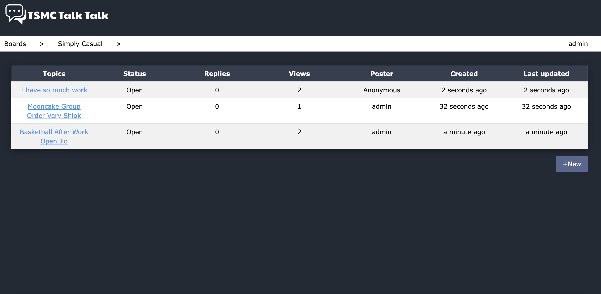

# TSMC Talk Talk

TSMC Talk Talk is a project that aims to promote meaningful 
and free conversations throughout the company, with the hope
to stimulate inspirations for innovations in different 
prospects. Built on Django, the architecture of the program
is simple and easily for future developers to expand and
maintain.

Talk Talk takes on a simplistic design that doesn't have a lot of 
annoying features and is made for its namesake -- to allow TSMC 
employees to be able to converse freely without having to populate 
the posts with multimedia. TSMC Talk Talk borrows its structure from
other popular forum websites such as PTT and DCard and splits discussion
groups into boards. Users can post what they want inside specific boards,
whether it's to discuss technical jargon or simply to invite people for 
a quick basketball game after work. We believe that with such a design,
people can be guided to relevant topics without complicated overhead
navigation.

Users can start topics within each board, just remember to post in the 
correct board!

Users can reply to the topic post simply by clicking reply.

Whether if you're posting or replying, TSMC Talk Talk provides the option
for users to go incognito. Hide your identity if you think it's a hassle!
Of course, any inappropriate comments can still be flagged and deleted by 
admin. Keep the discussions civil and chill!

Unlike any other community forum, TSMC Talk Talk also aims to support 
technical exchanges and advices within the company, so we took a leaf out 
of GitHub's book to introduce the close topic feature. Any topics that are 
no longer relevant can be closed off by the author, allowing colleague to 
know that the problem is solved.

TSMC Talk Talk also inherits an administration site from the Django framework
to better help manage the website.
